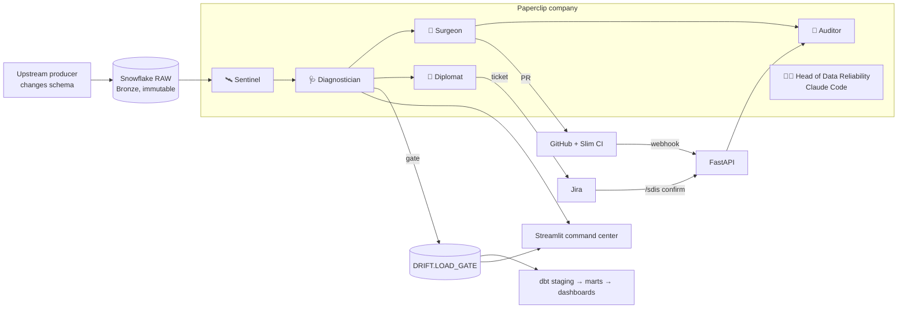

# 🛡️ Schema Drift Immune System

**An autonomous data-reliability company that detects, contains and fixes upstream schema drift in a dbt + Snowflake platform — before a dashboard breaks.**

Built on **Snowflake** (Bronze/control plane, MINHASH + HLL fingerprints, Cortex, Time Travel), **dbt** (contracts, lineage, Slim CI), **Paperclip** (org chart, heartbeats, budgets, approvals), **GitHub**, **Jira**, **FastAPI** and **Streamlit**.

> At 2 a.m. the orders service renames `CUST_ID` → `CUSTOMER_ID`. Five marts and four dashboards — including the CFO's revenue view — would break.
> SDIS holds the new load, proves it is a rename by matching the column's *values*, opens a one-line PR that keeps every downstream model unchanged, files a Jira ticket with the blast radius, and waits for a human to approve because it's SEV1.
> **Time to contain: under a minute. Time to resolve: one approval.**

---

## The five kinds of drift — and what the company does

| Drift | Example | How it's recognised (deterministic) | Gate | Fix | Human? |
|---|---|---|---|---|---|
| ➕ **Additive** | `DISCOUNT_CODE` added | new column nothing reads | PASS | documents the column in `sources.yml` | no — auto-merge on green CI |
| 🔁 **Rename** ★ | `CUST_ID` → `CUSTOMER_ID` | dropped + added column whose **values** match (MINHASH + HLL containment ≥ 0.9) | HOLD | remaps one source column; aliases unchanged | **yes** (SEV1, high blast radius) |
| ↔️ **Type widening** | `NUMBER(10,2)` → `NUMBER(18,2)` | lossless type lattice | HOLD | updates the contract type | no (SEV3) |
| 💥 **Breaking** | `STATUS` dropped, `IS_ACTIVE` added | dropped column / narrowing / incompatible type | QUARANTINE | **draft** PR: mapping proposed from value shares; Time Travel clone preserved | **yes** |
| 🧠 **Semantic** | `AMOUNT` switches INR → USD | median moved ≥3× and ≥6 robust z; ratio ≈ 84 matches INR→USD; restated rows confirm | QUARANTINE | after producer confirms: normalise new loads | **yes** |

★ = the LinkedIn demo scenario. Each has a ready SQL script in [`snowflake/scenarios/`](snowflake/scenarios).

## Why it's credible in production

- **Deterministic routing.** Class, severity, gate and approvals come from [`policies/playbooks.yaml`](policies/playbooks.yaml) — same inputs, same route, every time. Snowflake Cortex writes the human narrative *after* routing and is never read by the router.
- **Bronze is never touched.** Quarantine = a load gate (`DRIFT.LOAD_GATE`) that dbt staging respects. Agents' SQL is checked against a write-to-RAW guard.
- **Smallest possible fix.** The Surgeon edits a column *map*; staging SQL is re-rendered by codegen. A rename fix is literally one line, and Slim CI (`state:modified+ --defer`) builds exactly the blast radius.
- **Policy as code, tested.** 10 invariants ([`policies/invariants.yaml`](policies/invariants.yaml)) are each enforced in code and covered by tests (pattern from [aws-samples/sample-Agentic-Ai-Data-Operations](https://github.com/aws-samples/sample-Agentic-Ai-Data-Operations)).
- **Adopt in three steps.** `SDIS_MODE=observe` (detect + ticket, zero risk) → `advise` (+ PRs) → `protect` (+ load gate).
- **Unit economics.** Every query is tagged `{app, agent, incident}`, so credits per incident and MTTR land in a weekly ledger. Five of six agents are plain code → **$0 LLM tokens**.

## Architecture



## Quick start (2 minutes, no credentials)

```bash
pip install -e ".[api,dashboard,dev]"
sdis simulate rename          # the real engine on fixture data: decision, blast radius, the PR diff
pytest -q                     # 85 tests: all 5 scenarios end to end, invariants, API, dashboard, Paperclip package
uvicorn sdis.api:app --reload # → http://localhost:8000/docs
streamlit run streamlit/streamlit_app.py   # demo mode dashboard
```

Then follow **[docs/GUIDE.md](docs/GUIDE.md)** for Snowflake, Paperclip, GitHub/Jira, the live demo, FastAPI and DigitalOcean.

## Repository map

| Path | What |
|---|---|
| `sdis/` | engine (`sentinel`, `diagnostician`, `blast_radius`, `router`, `surgeon`, `codegen`), agents, Snowflake/GitHub/Jira/Paperclip clients, `api.py`, `cli.py` |
| `policies/` | playbooks (routing table) + invariants |
| `dbt/` | ShopVerse project: column maps → generated staging, marts, exposures, load-gate macro |
| `snowflake/` | account setup, control plane, seed, 5 drift scenarios, Streamlit-in-Snowflake |
| `company/` | Paperclip company package (agentcompanies/v1) + `.paperclip.yaml` |
| `streamlit/` | command center dashboard |
| `deploy/` | Docker, DigitalOcean cloud-init + Caddy + systemd, App Platform spec |
| `.github/` | CI (tests → Slim CI → deploy), security scan, CODEOWNERS |

## Honest limits

Blast radius is model-level lineage (not column-level). Low-cardinality renames are deliberately sent to a human. `ACCOUNT_USAGE` cost views lag a few hours. Paperclip's CLI import currently maps `process` agents to `claude_local`, so run `scripts/paperclip_setup.py` after importing. Not yet load-tested beyond demo volumes.

MIT © Karthik Valluri
